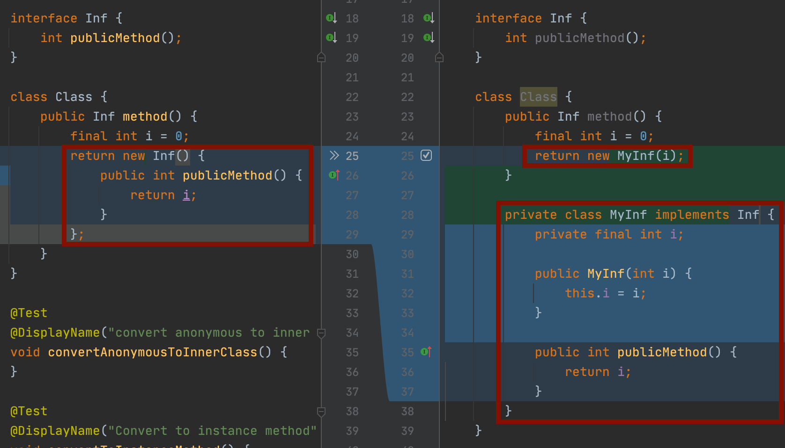
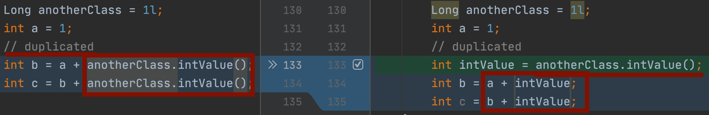
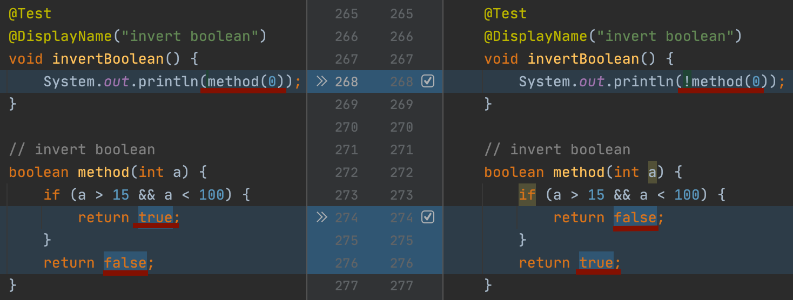
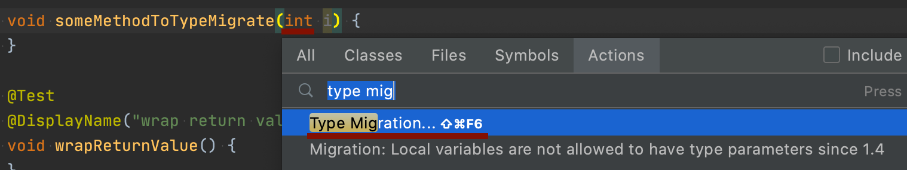

# Refactoring With IntelliJ Refactoring Tools

이 글은 Intellij의 Refactoring 메뉴에 있는 모든 Refactoring 기능들을 jetbrains 사이트의 예제 및 일부 보완한 예제를 통해 리팩토링시 주의 사항이나 전후를 비교한다.
com.example.refactorings.RefactoringTest 의 각 테스트를 따라서 보면서 화면과 같이 변화가 일어나도록 진행하면 됨

## 목차

- [Change Signature](#change-signature)
- [Convert Anonymous to Inner Class](#convert-anonymous-to-inner-class)
- [Convert to Instance Method](#convert-to-instance-method)
- [Encapsulate Fields](#encapsulate-fields)
- [Introduce Constants](#introduce-constants)
- [Introduce Field](#introduce-field)
- [Extract Interface](#extract-interface)
- [Extract Method](#extract-method)
- [Extract Super Class](#extract-super-class)
- [Introduce Variable](#introduce-variable)
- [introduce parameter](#introduce-parameter)
- [Extract Delegate](#extract-delegate)
- [Replace Method with Method Object](#replace-method-with-method-object)
- [Replace Conditional Logic with Strategy Pattern](#replace-conditional-logic-with-strategy-pattern)
- [Generify](#generify)
- [Inline Constructor](#inline-constructor)
- [Inline Superclass](#inline-superclass)
- [Inline To Anonymous Class](#inline-to-anonymous-class)
- [Invert Boolean](#invert-boolean)
- [Make Static](#make-static)
- [Migrate](#migrate)
- [Copy Class](#copy-class)
- [Move Method](#move-method)
- [Pull Members Up](#pull-members-up)
- [Remove Middleman](#remove-middleman)
- [Replace Constructor with Builder](#replace-constructor-with-builder)
- [Replace Constructor with Factory Method](#replace-constructor-with-factory-method)
- [Replace Inheritance with Delegation](#replace-inheritance-with-delegation)
- [Replace Temp with Query](#replace-temp-with-query)
- [Type Migration](#type-migration)
- [Wrap Return Value](#wrap-return-value)

## Change Signature

- Cage 클래스의 생성자에 height를 추가

## Convert Anonymous to Inner Class

- new나 생성자(Int())에 커서를 위치시키고 리팩토링

## Convert to Instance Method

- 메소드명에 커서를 위치시키고 리팩토링

## Encapsulate Fields

- 필드명에 커서를 위치시키고 리팩토링

## Introduce Constants

- 변수(“string”)에 커서를 위치시키고 리팩토링

## Introduce Field

- 변수(anotherClass.intValue())를 선태하고 리팩토링

## Extract Interface

## Extract Method

## Extract Super Class

## Introduce Variable

## Introduce Parameter

## Extract Delegate

## Replace Method with Method Object

## Replace Conditional Logic with Strategy Pattern

1. Replace Method with Method Object

2. Generalize Algorithm

3. Extract methods and implement them by copy & paste

4. Create Factory Method

5. Create Subclasses by Show Context Actions

6. Push Members Down

7. Remove Unused code using coverage

## Generify

## Inline Constructor

## Inline Superclass

## Inline To Anonymous Class

## Invert Boolean

## Make Static

## Migrate

## Copy Class

## Move Method

- 레퍼런스 타입이 없는 경우는 static으로 변환 후 이동

## Pull Members Up

## Remove Middleman

## Replace Constructor with Builder

## Replace Constructor with Factory Method

## Replace Inheritance with Delegation

## Replace Temp with Query

## Type Migration

## Wrap Return Value

